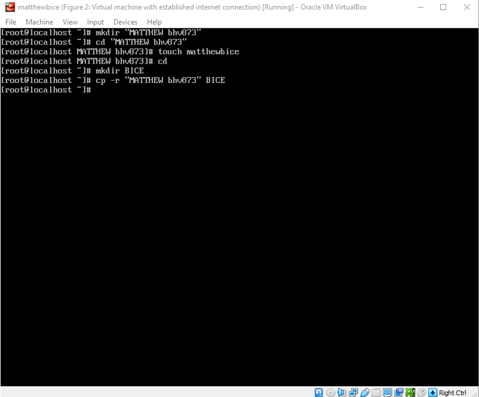
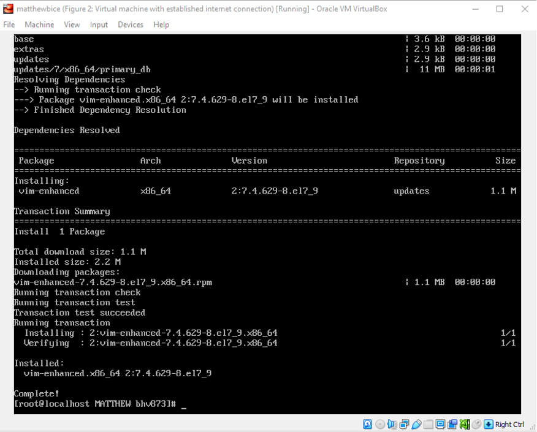
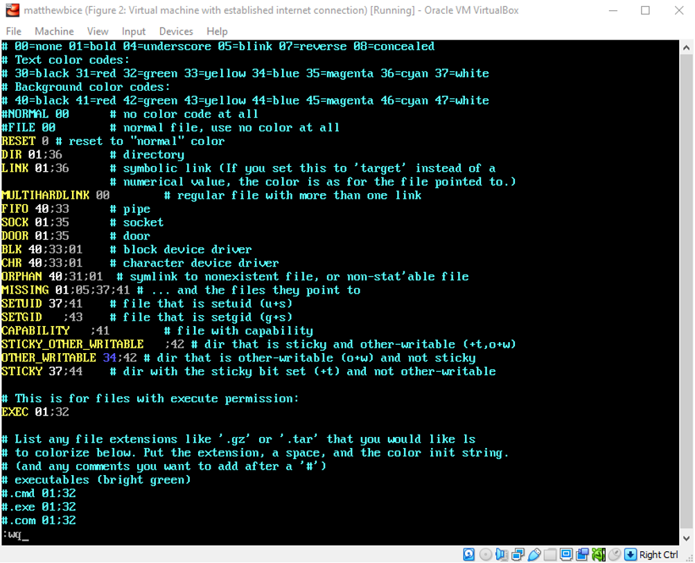

# Introduction

This lab will be covering a large scope of functionality in CentOS. It will begin with demonstrating common Linux commands through the performance of various steps. Then, the topic of security will be addressed regarding the machine’s bootloader and how it can be a potentially significant concern for security. Additionally, there will be a brief look at Linux’s “enhanced security” function. Finally, as a demonstration of the efficiency of yum and versatility of CentOS’s firewalls, there will be a brief activity wherein firewalls will be swapped back and forth.

# Practicing Basic Linux Commands

This lab will begin by briefly going over some key Linux commands. In this part of the lab, I will be using the command terminal to create directors and files, modify files, and install and use the text editor, Vim. After accessing my previously created virtual machine, I am ready to begin the lab.

## Step 1

To begin, I must create a new folder under the “root” directory. To do so, I type in the command, “mkdir ‘MATTHEW bhv873’”. The command “mkdir” creates a new folder in the terminal’s current directory path. After that, I simply follow the naming conventions as specified in the instructions. This folder will henceforth be referred to as my “abc123” folder.

- _Figure 1_: Creating the new folder. Notice how I included quotation marks in the name so that the “bhv873” after the space can be included. The “cd” command at the bottom will play a role in the next step.

  

## Step 2

The next step is to create a file within my new folder. First, I use the “cd” command to change my directory path so that it is within my “abc123” folder. Then, per the naming instructions, I use the command “touch matthewbice” to create a new file. The “touch” command creates an empty file that only has a name. I will be adding things to this file in the later steps.

- _Figure 2_: Changing my directory path to my “abc123” folder and creating the matthewbice file. Notice how the directory name has been changed from “~” to “MATTHEW bhv873” to reflect how I have changed directory locations.

  

## Step 3

In this step, I will be copying over my “abc123” folder, which includes my “matthewbice” file, to a new folder I will be making in the root directory. To do so, I first navigate back to the “root” folder by simply typing “cd” which will take me up one level. Then, I use the “mkdir” command to make a new folder named “BICE” (which will also be referred to as the “myname” folder). From there, I enter the following command: “cp -r “MATTHEW bhv873” BICE”. The “cp” command is the command terminal’s copy function. The “-r” option ensures that the folder is copied recursively. This means that any hidden files, such as those starting with a period, will be detected, and copied.

- _Figure 3_: Here, I navigate back to the “root” directory and create the new destination folder, “BICE.” Then, using the “cp -r” command, I copy the entirety of my abc123 folder into the myname folder.

  

## Step 4

In this step, I simply need to remove the original version of the abc123 folder located in the root directory. I do so by first ensuring that my location is set to the root directory, then entering the command, “rm -rf “MATTHEW bhv873””. The “rm” command will remove a specified file or directory. The first option, “-r”, is similar to the copy command in that it is a parameter that ensures files are deleted recursively. This can be thought of as a “quick delete”. Additionally, the “-f” option forces the removal of files without first prompting the user. This is added to ensure that the deletion is done with a single-line command per the lab instructions.

- _Figure 4_: In this screenshot, an error can be observed. I had initially entered the deletion command without the “-f” option. As a result, the command terminal was about to prompt me about the deletion of each individual file. Once I included this option, the deletion process was instead taken care of on a single line.

  

## Step 5

With the removal completed, I again use “cd” to return to the root directory. My next task is to add a line of text to my “matthewbice” file. To do so, I will be using the “echo” command which is used for adding content to a file. In this case, it will be a string of characters or, simply, a sentence. The command I use, then, is “echo “This lab is very late” >> matthewbice” (space after the angle brackets). In this command, I am adding the sentence, “This lab is very late” to the “myname” file. The double angle brackets, “>>” tells the machine that this data is being appended to the target file.

- _Figure 5_: Attaching a sentence to the “myname” file. Counterintuitively, the lack of feedback from the terminal implies that the command has been successfully executed.

  

## Step 6

While still in the root directory, this step will deal with another folder. Located in the machine’s “etc” folder is a configuration file, “DIR_COLORS”, which handles the text colors used for folders and file types. For instance, whenever, I folder is listed with the “ls” command, its name will appear in a dark blue or purple text color. This will be significant in a later step. Switching focus, this step deals greatly with piping. This is a technique to chain commands such that the output of the first command serves as the input for the second command and so on. In this instance, the command will be “cat etc/DIR_COLORS | grep “DIR 01;34” >> BICE/”MATTHEW bhv873”/matthewbice”. In this command, the output of the file DIR_COLORS is being used a location for the “grep” (Global Regular Expression Print) command to search for the keyword, “DIR 01;34”. Then, the results of the keyword search will be appended to the myname file.

- _Figure 6_: Entering the piping command. Previous terminal output has been cleared to avoid clutter. The command is entered, and the keyword is added to the myname file. To prove that this was successfully done, the “cat” command is entered again to display the contents of the myname file. In addition to the sentence I appended, “DIR 01;34		# directory” can also be seen. This was taken from the DIR_COLORS file.

  

## Step 7

In the later portion of this part, I will need to manually go in and edit a pre-existing file. To do so, I must first use the package manager, yum, to install Unix’s go-to text editor, vim. Using the command “yum install -y vim”, I install vim onto the machine. The following figures show the command terminal’s output at the beginning and end of this process.

- _Figure 7a_: The output after first entering the command. Yum is preparing the installation process by finding the best available mirrors.

  

- _Figure 7b_: The latter portion of the output. Here, the last of the plugins are being installed and the system verifies that the program is functional. The process is completed as is indicated at the bottom of the screen.

  

## Step 8

With vim fully installed, I can now begin the editing process. With my root directory selected, I enter the command “vim /etc/COLORS_DIR” to open the colors configuration file with vim. From there, I hit “i” to enter edit mode, then scroll down until I find the line that says, “DIR 01;34		#directory”. Notice that this line is identical to the one that was appended to the myname file. With this line selected, I move my cursor over and replace “34” with “36.” In Unix, this 01;36 is code for the color cyan. As a result, any time a directory is listed, its name will display as cyan.

- _Figure 8a_: The COLORS_DIR file opened in vim. The second line with yellow text is my line of interest. It had previously stated “DIR 01;34”, but this has now been changed to “DIR 01;36”.

  

- _Figure 8b_: This additional figure is proof that the operation was a success. Notice how when I use “ls” to display the contents of the root directory, the folder “myname” is displayed in cyan.

  

# "Hacking" the Root Account

This part of the lab will demonstrate how a root password can be reset. If I do not know the root password of the system, but I can still physically access the CentOS server, I can reset (or in this case, attack) the root password by accessing the GRUB (GRand Unified Bootloader). This the default bootloader for many Linux distributions (and, by proxy, CentOS). Its function is to load and transfer control to the operating system kernel software. The kernel, in turn, initializes the rest of the operating system (Gnu). This part of the lab is dedicated to showing how hackers can abuse this system.

## Setting Up

Before I can get started on this part of the lab, I must first reboot my system. After rebooting, I hit the arrow keys to prevent the OS from initializing. With the screen now stationary, there are two menu entries visible: The first is the regular CentOS, and the other is the rescue mode. I hit “e” to select the regular CentOS for editing.

## Editing the Configuration of the CentOS Menu Entry

While in editing mode, I can see all the settings and parameters that go behind initializing the operating system. I scroll down until I find the line specified in the directions and change the “ro”, which means “read only” to “rw”, which is read & write. From there, I add the following: init=/sysroot/bin/sh. From there, I hit “control” and the X key to go into single user mode. In this mode, the system offers as few services as possible and only minimal functionality. This is also known as the “maintenance mode” (LINFO).

- _Figure 9a_: The editing screen for the CentOS menu item. Highlighted are the modifications I made.

  

- _Figure9b_: My terminal after applying the changes. The machine is now in emergency (maintenance) mode, and there are no active directories.

  

Next, I am asked to type the command “chroot /sysroot”. The “chroot” command changes the root directory (Geeks for Geeks). In this case, the root directory will be “sysroot”. Then, I enter the command “passwd root” which will change the password for the root account (Red Hat). Per the directions, the new password will be “root”. The computer does not like this, however, and warns me that I have a “bad” password (that is, it is shorter than eight characters). After typing it again, the machine accepts it. The final steps are to create a new file called “/.autorelabel”, exit, and reboot.

- _Figure 9c_: Creating a new root director and password. Notice the initial rejection of the first password attempt. Towards the bottom of the screen, the creation of the new file, “/.autolabel” can be seen in addition to the exit and reboot commands.

  

## Discussion

The bootloader can be utilized for changing and bypassing the root password protection for the operating system because modifying the bootloader has a direct impact on the operating system. To provide a brief overview of the booting process, the CPU fetches the first instruction of BIOS from ROM, the BIOS loads the bootloader from the hard drive to RAM, the bootloader loads the OS from the hard drive to RAM, and the OS starts looping. In the case of the lab, I have interrupted the bootloader from loading the OS. It is the bootloaders job to load the kernel of the operating system (Ionos). As such, when you modify the bootloader, you are modifying the data that will be transferred to the OS. So, if you were to wipe the password data from the bootloader, the operating system, in turn, would have no password data either which thereby makes it possible to set a new password. This concept is useful for maintenance or resetting passwords but is also a major security issue.

# Hardening the GRUB Bootloader

In this part, I will be taking a closer look at the GRUB bootloader. To offer an alternative definition, it is a program that acts as the selection menu for operating systems when the computer starts up. This part will deal with locking down the GRUB with a password as an extra security measure against unauthorized users who can physically access the machine.

## Setting Up a Password for GRUB

I will begin by setting a new password for the GRUB. My CentOS has grub2 installed so I am able to change the GRUB password with the command, “grub2-setpassword”. The directions recommend that I set a password that is different from the root user’s password. As such my password will be “grubpass”.

- _Figure 10_: Setting a password for the GRUB. After entering the “set password” command, I am prompted to enter my new password. The terminal conceals it, but I have entered “grubpass” twice to set it as the new password. The empty prompt at the bottom implies this has been done successfully.

  

